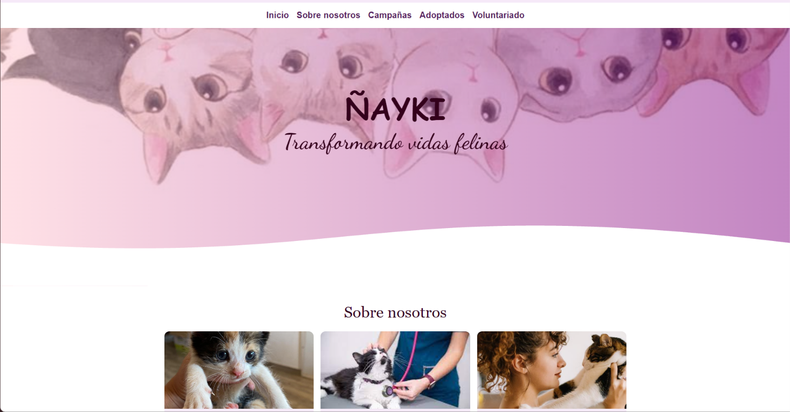
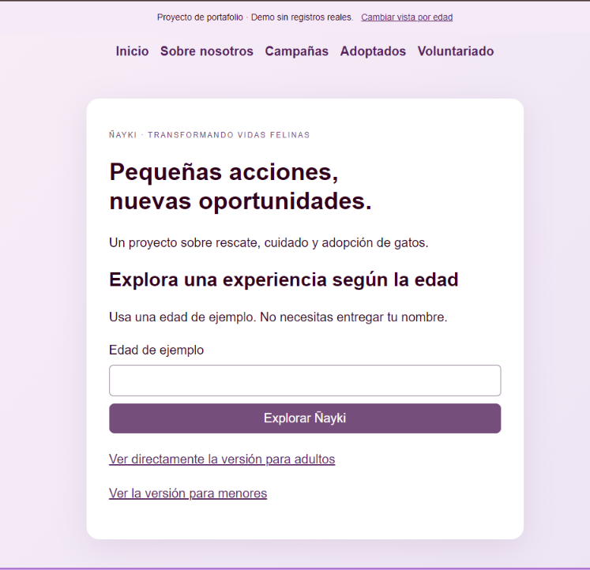
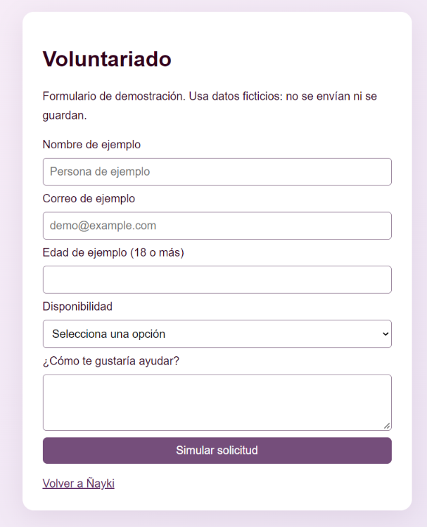

# Ñayki · Transformando vidas felinas

Sitio web de portafolio creado por **Rosio Leuquén Ramírez**, inspirado en el rescate, cuidado y adopción responsable de gatos.

Esta versión adapta el proyecto académico original de HTML, CSS, JavaScript, PHP y MySQL a una **demo estática compatible con GitHub Pages**. Los módulos anteriores se conservan en el historial del repositorio.

## Capturas

### Página principal


### Acceso por edad


### Voluntariado


## Funcionalidades

- Vistas para mayores y menores de edad.
- Sobre nosotros en tres tarjetas desplegables.
- Campañas en un carrusel con imágenes, avance automático, flechas y pausa.
- Galería de gatos adoptados.
- Formularios de adopción y voluntariado con validación y confirmación simulada.
- Encabezado y pie compartidos entre páginas.
- Diseño adaptable a pantallas pequeñas.

**Es una demostración:** los formularios no envían solicitudes ni guardan datos personales. No requiere PHP ni una base de datos.

## Tecnologías

HTML5, CSS3 y JavaScript. Imágenes y contenido del proyecto académico original.

## Ejecutar localmente

Dentro de la carpeta del proyecto:

```powershell
python -m http.server 8000
```

Abre http://localhost:8000. Detén el servidor con Ctrl + C.

## Estructura

```text
index.html             Bienvenida y selección de edad
mayores.html           Vista para adultos
menores.html           Vista para menores
adopcion.html          Solicitud de adopción simulada
voluntario.html        Formulario de voluntariado simulado
demo.js                Interacciones y carruseles
componentes/header.js  Encabezado compartido
componentes/footer.js  Pie de página compartido
CSS/                   Estilos
IMG/                   Imágenes del sitio
docs/capturas/         Capturas para este README
```

## Publicar en GitHub Pages

En este mismo repositorio, entra en **Settings → Pages**, elige **Deploy from a branch**, selecciona la rama principal y la carpeta **/ (root)**. Guarda y espera a que GitHub muestre el enlace del sitio. `index.html` debe quedar en la raíz del repositorio.

## Origen

Proyecto desarrollado durante la formación en Técnico en Informática. La versión original con PHP y MySQL está disponible en los commits anteriores; la versión actual permite explorar la interfaz desde un navegador sin servidor de aplicaciones.
